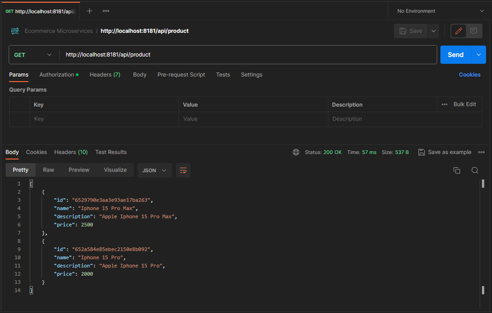
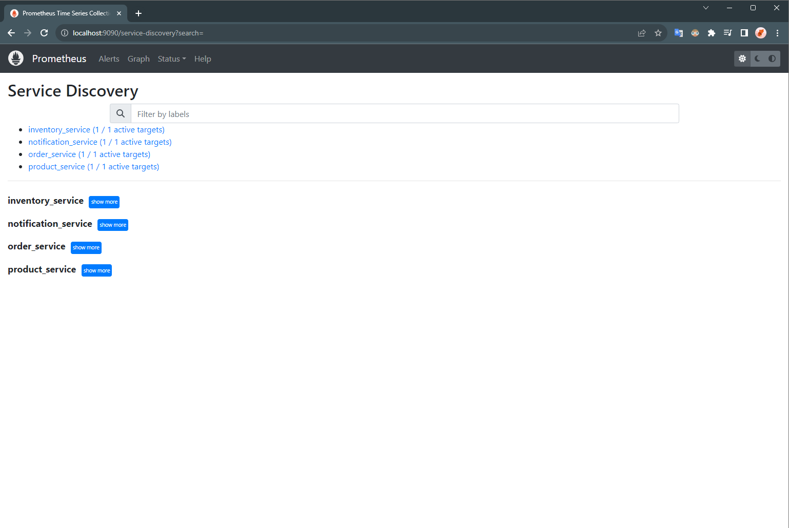

# Micro Marketplace: An E-commerce Microservices Application

## Solution Overview

Micro Marketplace is a robust e-commerce application built on a microservices architecture using Spring technologies and other open-source tools. 
- This platform leverages the power of **Spring Boot**, **Netflix Eureka**, **Spring Cloud Gateway**, and **KeyCloak** for service development, discovery, gateway management, and security, respectively. 
- It incorporates **Resilience4j** for resilient synchronous communication, and **Apache Kafka** for seamless event-driven asynchronous communication between services.
- It offers extensive observability into the application using **Micrometer** and **Zipkin** for distributed tracing, and **Prometheus** and **Grafana** for monitoring and visualization. 

With a focus on scalability, resilience, and real-time interaction, Micro Marketplace provides a robust foundation for creating feature-rich online marketplaces.


### Solution Architecture


### Services
- **Product Service:** Responsible for managing product information, including creation, retrieval, and updates. It uses a MongoDB database.
- **Order Service:** Handles order management, including creating and retrieving orders. It uses a MySQL database.
- **Inventory Service:** Manages products inventory. It also uses a MySQL database.
- **Notification Service:** A stateless service responsible for sending notifications to users regarding their orders or other relevant updates.

### Major Components
- **Frontend:** A modern web application built with Next.js, providing an intuitive user interface for customers to browse products, manage shopping cart, and place orders.
- **Discovery Server:** Netflix Eureka is employed for service registration and discovery, allowing microservices to locate and interact with each other dynamically.
- **API Gateway:** Spring Cloud Gateway is deployed to serve as the entry point for all external requests, effectively routing traffic to the appropriate microservices.
- **Auth Server:** For robust authentication and authorization mechanisms, KeyCloak is used to secure the microservices and protect sensitive data.
- **Circuit Breaker:** Resilience4j is used to maintain system reliability by preventing cascading failures in microservices through circuit-breaking mechanisms.
- **Message Broker:** Apache Kafka forms the backbone of Micro Marketplace's event-driven architecture, facilitating asynchronous notification for orders.
- **Observability Stack:** Distributed tracing is implemented to monitor and troubleshoot requests as they traverse different microservices, using Micrometer for metrics and Zipkin for tracing. 
   Moreover, Prometheus is used for collecting metrics, and Grafana for providing a rich dashboard for visualizing and analyzing application performance data.

### Tech Stack Used
<div>
    <table>
        <tr>
            <td>
                <strong>Frontend</strong>
            </td>
            <td>
                <a href="https://nextjs.org/" target="_blank">
                    
                </a>
                &emsp;
                <a href="https://reactjs.org/" target="_blank">
                    
                </a>
                &emsp;
                <a href="https://www.typescriptlang.org/" target="_blank">
                    
                </a>
                &emsp;
                <a href="https://tailwindcss.com/" target="_blank">
                    
                </a>
                &emsp;
            </td>
        </tr>
        <tr>
            <td>
                <strong>Languages & Frameworks</strong>
            </td>
            <td>
                <a href="ttps://www.java.com/en/">
                    
                </a>
                &emsp;
                <a href="https://spring.io/projects/spring-boot" target="_blank">
                    
                </a>
                &emsp;
                <a href="https://spring.io/projects/spring-cloud" target="_blank">
                    
                </a>
                &emsp;
            </td>
        </tr>
        <tr>
            <td>
                <strong>Databases & Message Queue</strong>
            </td>
            <td>
                <a href="https://mongodb.io/" target="_blank"> 
                    
                </a>
                &emsp;
                <a href="https://mysql.com/" target="_blank"> 
                    
                </a>
                &emsp;
                <a href="https://kafka.apache.org/" target="_blank"> 
                    
                </a>
                &emsp;
            </td>
        </tr>
        <tr>
            <td>
                <strong>API Gateway</strong>
            </td>
            <td>
                <a href="https://spring.io/projects/spring-cloud-gateway" target="_blank"> 
                    
                </a>
                &emsp;
            </td>
        </tr>
        <tr>
            <td>
                <strong>Service Discovery</strong>
            </td>
            <td>
                <a href="https://spring.io/projects/spring-cloud-netflix" target="_blank"> 
                    
                </a>
                &emsp;
            </td>
        </tr>
        <tr>
            <td>
                <strong>Circuit Breaker</strong>
            </td>
            <td>
                <a href="https://resilience4j.readme.io/" target="_blank"> 
                    
                </a>
                &emsp;
            </td>
        </tr>
        <tr>
            <td>
                <strong>Security</strong>
            </td>
            <td>
                <a href="https://www.keycloak.org/" target="_blank"> 
                    
                </a>
                &emsp;
            </td>
        </tr>
        <tr>
            <td>
                <strong>Observability</strong>
            </td>
            <td>
                <a href="https://micrometer.io/" target="_blank"> 
                    
                </a>
                &emsp;
                <a href="https://zipkin.io/" target="_blank"> 
                    
                </a>
                &emsp;
                <a href="https://prometheus.io/" target="_blank"> 
                    
                </a>
                &emsp;
                <a href="https://grafana.com/" target="_blank"> 
                    
                </a>
                &emsp;
            </td>
        </tr>
        <tr>
            <td>
                <strong>Build & Containerization</strong>
            </td>
            <td>
                <a href="https://maven.apache.org/" target="_blank"> 
                    
                </a>
                &emsp;
                <a href="https://www.docker.com/" target="_blank"> 
                    
                </a>
                &emsp;
                <a href="https://github.com/GoogleContainerTools/jib" target="_blank"> 
                    
                </a>
                &emsp;
            </td>
        </tr>
    </table>
</div>


## Getting Started

### Prerequisites
1. Docker and Docker Compose should be installed.
2. Docker should be running.

### Deployment

1. Navigate to the project directory:
   ```shell
   cd ecommerce-microservices
   ```

2. Start the containers:
   ```shell
   docker compose up -d
   ```


3. Confirm that the containers are up and running:
   ```shell
   docker ps
   ```


## Usage


### Interacting with Application

#### Frontend Application

- **Accessing the Frontend**
  - Access the frontend application at http://localhost:3001
  - Browse products, add to cart, and place orders through the user-friendly interface
  - Login using Keycloak authentication to access protected features

- **Frontend Features**
  - Product browsing and search
  - Shopping cart management
  - Order placement and tracking
  - User authentication and profile management

#### Backend Services

- **Getting Credentials from KeyCloak**
  - Access the KeyCloak Admin UI at http://localhost:8080/
  - Go to the Realm `spring-boot-microservices-realm`
  - Go to the Client `spring-cloud-client`
  - Go the the 'Credentials' section, and get the 'Client Secret'


- **Setup Postman Authentication** [Required for direct API testing]
  - On the Request page, set Authorization:
    - Type: `OAuth 2.0`
    - Configure New Token with:
      - Token Name: `token`
      - Grant Type: `Client Credentials`
      - Access Token URL: `http://keycloak:8080/realms/spring-boot-microservices-realm/protocol/openid-connect/token`
      - Client ID: `spring-cloud-client`
      - Client Secret: `<client-secret>` (which you copied in the last step from KeyCloak)
    - Click on "Get New Access Token" and then click "Use Token"

    > NOTE: For getting the access token from the keycloak container with the local machine, it is required to add a row with `127.0.0.1 keycloak` in the file: `C:\Windows\System32\drivers\etc\hosts` or `/etc/hosts`  

- **Accessing API Endpoints**
  - **POST /api/product**
    - Method: POST
    - Endpoint: http://localhost:8181/api/product
    - Authorization: Use the OAuth 2.0 token fetched, following the previous step.
    - Body: 
      ```json
      {
         "name": "Iphone 15",
         "description": "Apple Iphone 15",
         "price": 1500
      } 
      ```
    - Output:
        
        
  
  - GET /api/product
    - Method: GET
    - Endpoint: http://localhost:8181/api/product
    - Authorization: Use the OAuth 2.0 token fetched, following the previous step.
    - Output:
        
 
  - POST /api/order
    - Method: POST
    - Endpoint: http://localhost:8181/api/order
    - Authorization: Use the OAuth 2.0 token fetched, following the previous step.
    - Body:
      ```json
      {
         "orderLineItemsDtoList": [
           {
              "skuCode": "iphone_15_pro",
              "price": 2000,
              "quantity": 1
            }
         ]
      }  
      ```
    - Output:
      
      
      

### Components UI

- KeyCloak Admin UI
   - Keycloak UI can be accessed on http://localhost:8080/
   - Realm: `spring-boot-microservices-realm`
     
   - Client: `spring-cloud-client`
    


- Eureka Dashboard
   - Services (Clients) discovered can be viewed on http://localhost:8761/
    


- Zipkin UI
   - Traces for the API calls can be accessed on http://localhost:9411/zipkin/
    


- Prometheus UI
    - Prometheus UI can be accessed on http://localhost:9090/
    - Prometheus Graph Query
      
    - Prometheus Targets Health
      
    - Prometheus Service Discovery Status
      

- Grafana Dashboard
  - Grafana Dashboard can be accessed on http://localhost:3000/
  - To visualize the application, create a 'Data Source' and import the dashboard using `grafana-dashboard.json` file.
  - Data Source
    
  - Dashboard [Collapsed]
    
  - Dashboard
    
    


## Application Workflow

### System Architecture and Data Flow

Micro Marketplace sử dụng kiến trúc microservices với luồng dữ liệu như sau:


1. **User Authentication Flow**:
   - Người dùng truy cập frontend (http://localhost:3001) và đăng nhập thông qua Keycloak
   - Keycloak xác thực người dùng và cung cấp JWT token
   - Frontend lưu trữ token và sử dụng nó cho các API calls tiếp theo
   - API Gateway xác thực token trước khi chuyển tiếp yêu cầu đến các services

2. **Product Browsing Flow**:
   - Frontend gửi request đến API Gateway (http://localhost:8181/api/product)
   - API Gateway định tuyến request đến Product Service
   - Product Service truy vấn MongoDB để lấy thông tin sản phẩm
   - Dữ liệu được trả về cho người dùng thông qua API Gateway

3. **Order Processing Flow**:
   - Người dùng thêm sản phẩm vào giỏ hàng (được lưu trữ trong frontend)
   - Khi checkout, frontend gửi request đến API Gateway (http://localhost:8181/api/order)
   - API Gateway định tuyến request đến Order Service
   - Order Service thực hiện các bước sau:
     - Lưu thông tin đơn hàng vào MySQL database
     - Gọi đến Inventory Service để kiểm tra và cập nhật tồn kho
     - Gửi sự kiện "order-placed" đến Kafka
   - Notification Service lắng nghe sự kiện từ Kafka và gửi thông báo

4. **Inventory Management Flow**:
   - Inventory Service nhận request từ Order Service
   - Kiểm tra số lượng tồn kho trong MySQL database
   - Cập nhật số lượng tồn kho nếu đủ hàng
   - Trả về kết quả cho Order Service

5. **Notification Flow**:
   - Notification Service lắng nghe các sự kiện từ Kafka
   - Khi nhận được sự kiện "order-placed", service xử lý và gửi thông báo

6. **Observability Flow**:
   - Tất cả services gửi metrics đến Prometheus
   - Distributed tracing được thực hiện thông qua Zipkin
   - Grafana hiển thị dashboard với dữ liệu từ Prometheus

### Frontend Application Flow

Frontend ứng dụng được xây dựng với Next.js và có luồng hoạt động như sau:

1. **Authentication**:
   - Người dùng đăng nhập thông qua NextAuth.js tích hợp với Keycloak
   - Sau khi đăng nhập, token được lưu trữ trong session
   - Header component hiển thị trạng thái đăng nhập và các tùy chọn tương ứng

2. **Product Management**:
   - Trang chủ hiển thị giới thiệu về ứng dụng
   - Trang Products hiển thị danh sách sản phẩm từ Product Service
   - Mỗi sản phẩm được hiển thị trong ProductCard component
   - Người dùng có thể thêm sản phẩm vào giỏ hàng

3. **Shopping Cart**:
   - Giỏ hàng được quản lý bởi Zustand store
   - Người dùng có thể thêm, xóa, cập nhật số lượng sản phẩm
   - Giỏ hàng được lưu trữ trong localStorage để giữ nguyên khi refresh

4. **Order Placement**:
   - Người dùng checkout từ trang Cart
   - Frontend gửi thông tin đơn hàng đến Order Service
   - Sau khi đặt hàng thành công, giỏ hàng được xóa và người dùng được chuyển đến trang Orders

5. **Order History**:
   - Trang Orders hiển thị lịch sử đơn hàng của người dùng
   - Thông tin đơn hàng được lấy từ Order Service
   - Đơn hàng được hiển thị với trạng thái và chi tiết

### Sequence Diagram


## Environment Cleanup

- To completely stop and remove the containers and other resources (network, volume, etc.), run the following command:
   ```shell
   docker compose down -v
   ```
